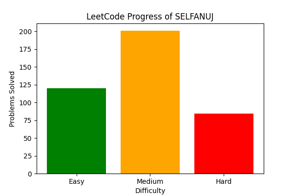

# 🚀 LeetCode Progress of SELFANUJ

📊 **LeetCode Stats:**  

---

**Total Solved:** 403  
- 🟢 Easy: 120  
- 🟠 Medium: 201  
- 🔴 Hard: 82  

| Difficulty | Problems Solved |
|------------|----------------|
| 🟢 Easy   | 120 |
| 🟠 Medium | 201 |
| 🔴 Hard   | 82 |

🔥 Updated daily with **GitHub Actions**!  

---

### 📌 How It Works:
- This repo **automatically updates** your LeetCode solutions and progress.
- The `sync_solutions.py` script fetches **your latest stats** and updates this README.

🚀 **Happy Coding!**
